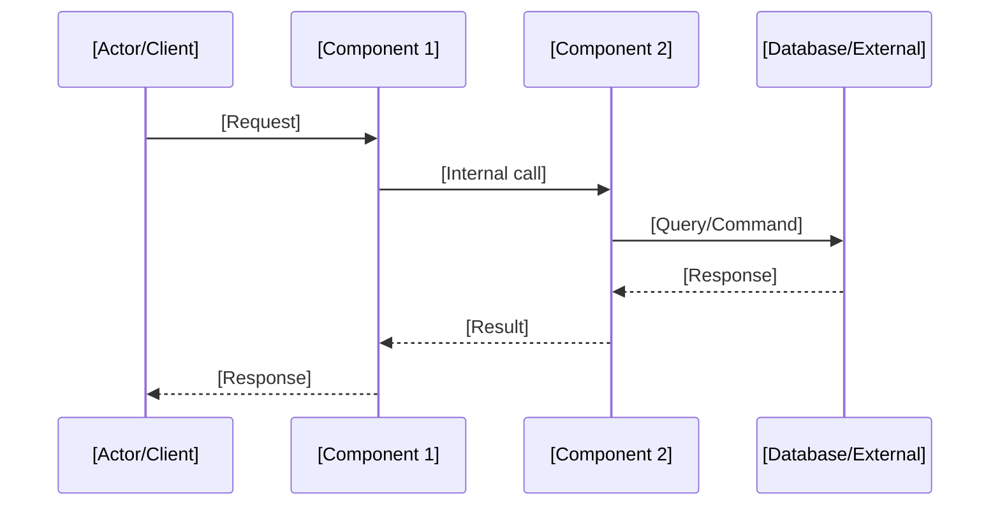
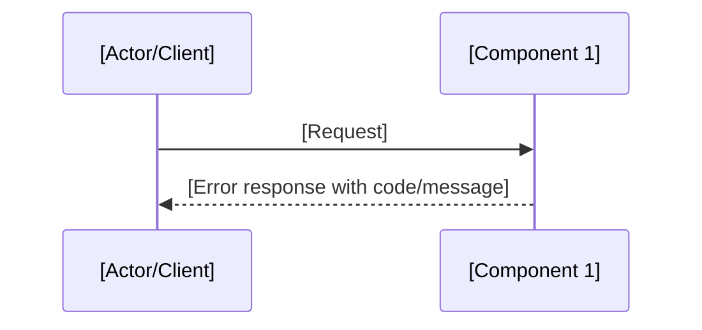

# Design: [Feature Name]

## Architecture Overview

[High-level description of the system architecture and how this feature fits in]

## Component Design

### [Component 1 Name]

- **Purpose**: [What this component does]
- **Responsibilities**: [Key responsibilities]
- **Interfaces**: [Public APIs, events, data contracts]
- **Dependencies**: [Internal and external dependencies]

### [Component 2 Name]

- **Purpose**: [What this component does]
- **Responsibilities**: [Key responsibilities]
- **Interfaces**: [Public APIs, events, data contracts]
- **Dependencies**: [Internal and external dependencies]

## Sequence Diagrams

### Main Flow



### Error Flow



## Data Model

### New Entities/Tables

| Entity   | Fields                       | Relationships         |
| -------- | ---------------------------- | --------------------- |
| [Entity] | [field1: type, field2: type] | [FK to X, 1:N with Y] |

### Schema Changes

```sql
ALTER TABLE [table] ADD COLUMN [column] [type];
CREATE INDEX [idx_name] ON [table]([column]);
```

### Data Migrations

[Describe any data migration steps needed, or "None"]

## API Design

### Endpoints

| Method | Path                    | Description     | Auth     |
| ------ | ----------------------- | --------------- | -------- |
| POST   | /api/v1/[resource]      | Create resource | Required |
| GET    | /api/v1/[resource]/{id} | Get resource    | Required |

### Request/Response Examples

```json
// POST /api/v1/[resource]
{
  "field1": "value",
  "field2": 123
}

// Response 201 Created
{
  "id": "uuid",
  "field1": "value",
  "createdAt": "2024-01-01T00:00:00Z"
}
```

## Error Handling

| Error Scenario     | HTTP Status | Error Code       | Message                   |
| ------------------ | ----------- | ---------------- | ------------------------- |
| Resource not found | 404         | NOT_FOUND        | "Resource not found"      |
| Validation failed  | 400         | VALIDATION_ERROR | "Invalid input: [field]"  |
| Unauthorized       | 401         | UNAUTHORIZED     | "Authentication required" |

## Security Considerations

- [Authentication/authorization requirements]
- [Input validation strategy]
- [Data encryption needs]
- [Rate limiting / throttling]
- [Sensitive data handling]

## Property-Based Test Properties

| Property | Source Req | Description                                                              |
| -------- | ---------- | ------------------------------------------------------------------------ |
| P1       | REQ-1.1    | For any [input space], when [condition], the system [expected invariant] |
| P2       | REQ-1.2    | For any [input space], while [state], the system [expected invariant]    |

## Testing Strategy

- **Unit Tests**: [What to test in isolation]
- **Integration Tests**: [What to test across components]
- **Property-Based Tests**: [Properties to validate — see table above]
- **E2E Tests**: [Key user journeys to cover]
- **Performance Tests**: [Load/stress test scenarios]

## Implementation Considerations

- **Trade-offs**: [What was prioritized and why]
- **Alternatives Considered**: [Other approaches and why rejected]
- **Risks**: [Potential issues and mitigation]
- **Future Extensibility**: [How this design supports future changes]
