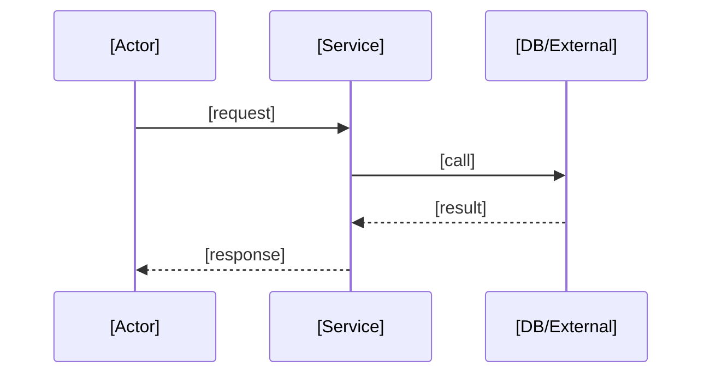
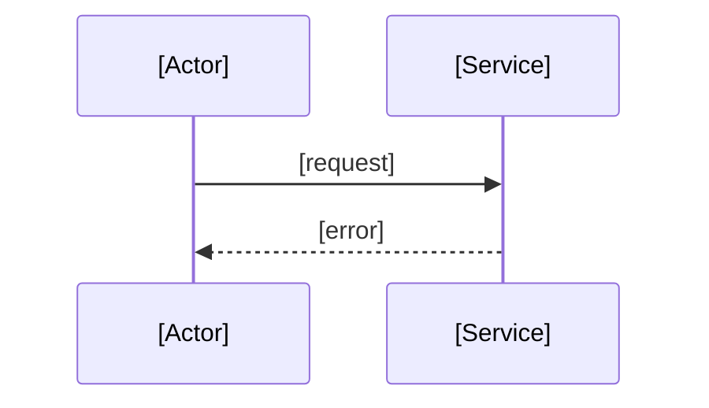

# Design: [Feature Name]

## Approach
[choice + reason]

## Components
### [Comp A]
- Purpose: [what]
- API/contract: [shape]
- Deps: [deps]

### [Comp B] (optional)
- Purpose: [what]
- API/contract: [shape]
- Depends: [deps]

## Flows
### Main

### Error

## Data/API changes (if any)
- Schema: [change or none]
- API: `[METHOD] /path` -> [purpose]

## Properties (from REQ)
| Property | Source Req | Description |
| --- | --- | --- |
| P1 | REQ-1.1 | [invariant] |

## Risks + not-now
- Risks: [risk -> mitigation]
- Not now: [defer list]
