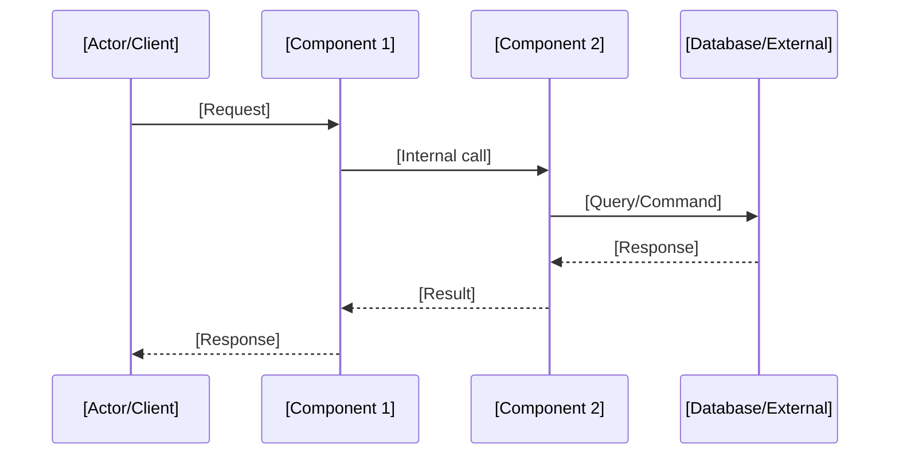
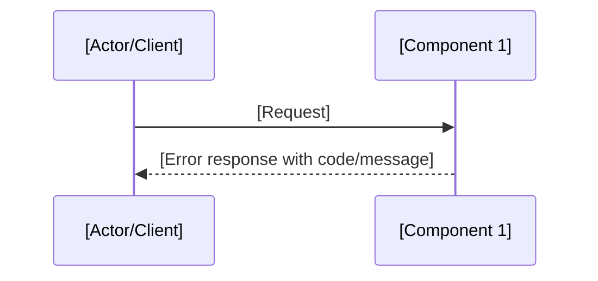

# Spec Templates

## requirements.md

```markdown
# Feature: [Feature Name]

## Overview
[Brief description of the feature, its purpose, and the problem it solves]

## User Stories

### Story 1: [Story Title]
As a [role], I want [capability], so that [benefit].

#### Requirements
- REQ-1.1: WHEN [event] THE SYSTEM SHALL [behavior]
- REQ-1.2: WHILE [state] THE SYSTEM SHALL [behavior]
- REQ-1.3: IF [condition] THEN THE SYSTEM SHALL [behavior]

#### Acceptance Criteria
- [ ] Given [context], when [action], then [outcome]
- [ ] Given [context], when [action], then [outcome]

### Story 2: [Story Title]
As a [role], I want [capability], so that [benefit].

#### Requirements
- REQ-2.1: WHEN [event] THE SYSTEM SHALL [behavior]
- REQ-2.2: THE SYSTEM SHALL [always-true behavior]

#### Acceptance Criteria
- [ ] Given [context], when [action], then [outcome]

## Non-Functional Requirements
- **Performance**: [e.g., API response time < 200ms at p95]
- **Security**: [e.g., All endpoints require authentication]
- **Scalability**: [e.g., Support 1000 concurrent users]
- **Reliability**: [e.g., 99.9% uptime SLA]
- **Compliance**: [e.g., GDPR data handling requirements]

## Out of Scope
- [What is explicitly NOT included in this feature]

## Dependencies
- [External systems, APIs, or other features this depends on]
```

---

## design.md (Feature — High Level Design)

Use this template for complex systems, team collaboration, and thorough documentation.

```markdown
# Design: [Feature Name]

## Architecture Overview
[High-level description of the system architecture and how this feature fits in]

## Component Design

### [Component 1 Name]
- **Purpose**: [What this component does]
- **Responsibilities**: [Key responsibilities]
- **Interfaces**: [Public APIs, events, data contracts]
- **Dependencies**: [Internal and external dependencies]

### [Component 2 Name]
- **Purpose**: [What this component does]
- **Responsibilities**: [Key responsibilities]
- **Interfaces**: [Public APIs, events, data contracts]
- **Dependencies**: [Internal and external dependencies]

## Sequence Diagrams

### Main Flow


### Error Flow


## Data Model

### New Entities/Tables
| Entity | Fields | Relationships |
|--------|--------|---------------|
| [Entity] | [field1: type, field2: type] | [FK to X, 1:N with Y] |

### Schema Changes
```sql
ALTER TABLE [table] ADD COLUMN [column] [type];
CREATE INDEX [idx_name] ON [table]([column]);
```

### Data Migrations
[Describe any data migration steps needed, or "None"]

## API Design

### Endpoints
| Method | Path | Description | Auth |
|--------|------|-------------|------|
| POST | /api/v1/[resource] | Create resource | Required |
| GET | /api/v1/[resource]/{id} | Get resource | Required |

### Request/Response Examples
```json
// POST /api/v1/[resource]
{
  "field1": "value",
  "field2": 123
}

// Response 201 Created
{
  "id": "uuid",
  "field1": "value",
  "createdAt": "2024-01-01T00:00:00Z"
}
```

## Error Handling
| Error Scenario | HTTP Status | Error Code | Message |
|----------------|-------------|------------|---------|
| Resource not found | 404 | NOT_FOUND | "Resource not found" |
| Validation failed | 400 | VALIDATION_ERROR | "Invalid input: [field]" |
| Unauthorized | 401 | UNAUTHORIZED | "Authentication required" |

## Security Considerations
- [Authentication/authorization requirements]
- [Input validation strategy]
- [Data encryption needs]
- [Rate limiting / throttling]
- [Sensitive data handling]

## Property-Based Test Properties
Properties extracted from EARS requirements for PBT validation:

| Property | Source Req | Description |
|----------|-----------|-------------|
| P1 | REQ-1.1 | For any [input space], when [condition], the system [expected invariant] |
| P2 | REQ-1.2 | For any [input space], while [state], the system [expected invariant] |

## Testing Strategy
- **Unit Tests**: [What to test in isolation]
- **Integration Tests**: [What to test across components]
- **Property-Based Tests**: [Properties to validate across input spaces — see table above]
- **E2E Tests**: [Key user journeys to cover]
- **Performance Tests**: [Load/stress test scenarios]

## Implementation Considerations
- **Trade-offs**: [What was prioritized and why]
- **Alternatives Considered**: [Other approaches and why rejected]
- **Risks**: [Potential issues and mitigation]
- **Future Extensibility**: [How this design supports future changes]
```

---

## design.md (Feature — Low Level Design)

Use this template for rapid prototyping, quick feasibility checks, and solo development.

```markdown
# Design: [Feature Name]

## Technical Approach
[Brief description of the chosen approach and why]

## Pseudocode / Algorithm

### [Core Algorithm Name]
```
function processRequest(input):
    validate(input)
    result = transform(input)
    persist(result)
    return formatResponse(result)
```

## Interface Definitions

### [Interface/Contract Name]
```
interface [Name] {
    method1(param: Type): ReturnType
    method2(param: Type): ReturnType
}
```

## Key Data Structures
```
struct [Name] {
    field1: Type
    field2: Type
    field3: Map<Key, Value>
}
```

## Non-Functional Properties
- **Latency target**: [e.g., < 100ms p95]
- **Throughput**: [e.g., 1000 req/s]
- **Memory**: [e.g., < 256MB per instance]
- **Concurrency**: [e.g., thread-safe, lock-free]

## Property-Based Test Properties
| Property | Source Req | Description |
|----------|-----------|-------------|
| P1 | REQ-1.1 | For any [input space], when [condition], the system [expected invariant] |

## Error Handling
[Key error cases and how they're handled]

## Dependencies
[Libraries, services, or APIs required]
```

---

## tasks.md

```markdown
# Tasks: [Feature Name]

| # | Task | Status | Required |
|---|------|--------|----------|
| 1 | [Task title with clear outcome] | [ ] | Yes |
| 2 | [Task title with clear outcome] | [ ] | Yes |
| 3 | [Task title with clear outcome] | [ ] | Yes |
| 4 | [Property-based tests for REQ-N.M] | [ ] | No |
| 5 | [Task title with clear outcome] | [ ] | No |

Status legend: `[ ]` pending · `[~]` in-progress · `[x]` done

## Task Details

### Task 1: [Title]
- **Description**: [What needs to be done and why]
- **Files to create/modify**:
  - `src/[path]/[file]` — [what changes and why]
- **Acceptance criteria**:
  - [ ] [Specific, verifiable check]
  - [ ] [Specific, verifiable check]
- **Dependencies**: None

### Task 2: [Title]
- **Description**: [What needs to be done and why]
- **Files to create/modify**:
  - `src/[path]/[file]` — [what changes and why]
- **Acceptance criteria**:
  - [ ] [Specific, verifiable check]
- **Dependencies**: Task 1

### Task 3: [Title]
- **Description**: [What needs to be done and why]
- **Files to create/modify**:
  - `src/[path]/[file]` — [what changes and why]
- **Acceptance criteria**:
  - [ ] [Specific, verifiable check]
- **Dependencies**: Task 2

### Task 4: Property-Based Tests
- **Description**: Implement PBT for key requirements to validate properties across input spaces
- **Properties to test**:
  - P1 (REQ-1.1): For any [input], when [condition], [invariant holds]
  - P2 (REQ-2.1): For any [input], when [condition], [invariant holds]
- **Files to create/modify**:
  - `tests/[path]/[file].property.test` — [property-based test implementations]
- **Acceptance criteria**:
  - [ ] Properties pass for all generated inputs (100+ iterations)
  - [ ] Shrinking produces minimal counter-examples on failure
- **Dependencies**: Task 1, Task 2

## Execution Order
1. Task 1 (no dependencies)
2. Task 2 (depends on Task 1)
3. Task 3 (depends on Task 2)
4. Task 4 — PBT (optional, parallelizable with Task 3)
5. Task 5 (optional)
```

---

## bugfix.md

```markdown
# Bugfix: [Bug Title]

## Bug Analysis

### Current Behavior (Defect)
- WHEN [specific condition/reproduction steps] THEN the system [incorrect behavior]

### Expected Behavior (Correct)
- WHEN [same condition] THEN the system SHALL [correct behavior]

### Unchanged Behavior (Regression Prevention)
- WHEN [condition] THEN the system SHALL CONTINUE TO [existing behavior that must be preserved]
- WHEN [condition] THEN the system SHALL CONTINUE TO [another behavior to preserve]

## Reproduction Steps
1. [Step 1: Setup/context]
2. [Step 2: Action that triggers bug]
3. [Step 3: Observe incorrect behavior]

## Impact Assessment
- **Severity**: [Critical/High/Medium/Low]
- **Affected users/components**: [Who/what is impacted]
- **Frequency**: [Always/Often/Rarely/Edge case]
- **Workaround**: [If any exists, describe it; otherwise "None"]

## Environment
- **Version**: [App version where bug occurs]
- **Platform**: [OS/browser/runtime if applicable]
- **Data conditions**: [Specific data or state that triggers the bug]
```

---

## design.md (Bugfix)

```markdown
# Design: Bugfix for [Bug Title]

## Root Cause Analysis
[Detailed explanation of why the bug occurs — trace through the code path, identify the exact line/function where behavior diverges]

## Proposed Fix
[Approach to fix the issue — specific files and logic changes. Be surgical: change only what's necessary]

## Property-Based Test Properties

Three categories of properties validate the fix:

### Bug Exists (pre-fix verification)
These tests MUST fail before the fix is applied:
- `WHEN [condition] THEN [incorrect behavior]` — confirms the bug is reproducible
- For any [input in bug-triggering space], the system produces [incorrect result]

### Fix Works (post-fix verification)
These tests MUST pass after the fix is applied:
- `WHEN [condition] THEN [correct behavior]` — confirms the fix resolves the issue
- For any [input in bug-triggering space], the system produces [correct result]

### No Regressions (preservation verification)
These tests MUST pass both before AND after the fix:
- `WHEN [unchanged condition] THEN [existing behavior]` — confirms no side effects
- For any [input in unaffected space], the system continues to produce [expected result]

## Files to Modify
| File | Change |
|------|--------|
| `[path/to/file]` | [What changes and why] |
| `[path/to/test]` | [New/updated test cases — including PBT] |

## Risk Assessment
- **Risk level**: [Low/Medium/High]
- **Potential side effects**: [List anything that could be inadvertently affected]
- **Mitigation**: [How to detect or prevent unintended side effects]
- **Rollback plan**: [How to revert if the fix causes issues]
```
